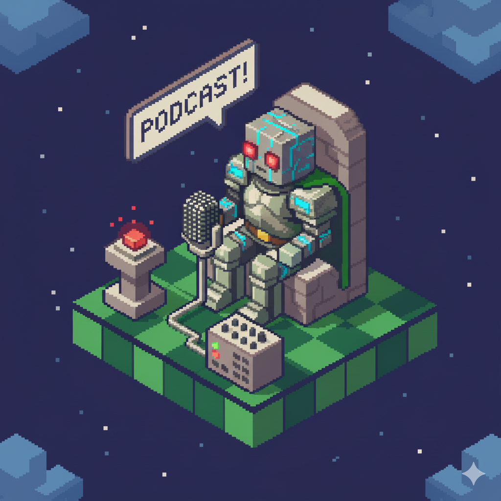

    preview do podcast

    <audio src="output/podcast_completo.MP3" controls title="Podcast Completo"></audio>

# Projeto Podcast Gerado por I.A.s

 > ℹ️ **NOTE:** Este é o repositório desenvolvido durante um curso da [DIO](https://dio.me)

Projeto com o objetivo de gerar um podcast utilizando ferramentas de IA através de prompts mais trabalhado.

Utilizou-se uma esteira de prompts para gerar cada etapa do processo criativo.

## 🎙️ A Nova Esperança Neural
Explorando as conexões que moldam o amanhã

A Nova Esperança Neural é um podcast experimental criado 100% com o apoio de Inteligências Artificiais, com o objetivo de apresentar de forma leve e acessível curiosidades, dicas e novidades sobre o universo da IA. Voltado para iniciantes e entusiastas de tecnologia, o podcast mistura informação e entretenimento com uma pegada nerd divertida.

O primeiro episódio traz explicações simples sobre como as inteligências artificiais aprendem com exemplos, além de apresentar ferramentas fáceis de usar, como o Teachable Machine do Google.

Este projeto demonstra o potencial criativo do uso combinado de ferramentas de IA para gerar roteiro, voz, imagens e edição, resultando em um conteúdo completo e original.

## 💻 Tecnologias utilizadas no projeto

- [ChatGPT](https://chat.openai.com/) 
- [MidJourney](https://www.midjourney.com/app/)
- [ElevenLabs](https://beta.elevenlabs.io/)
- [Capcut](https://www.capcut.com/pt-br/)

## ✨ Como foi feito ?

- Roteiro gerado via chatgpt
- Audio gerado pela elevenLabs
- Midjourney Para gerar capas
- Capcut para tratar aúdio e adicionar sons de fundo

## 👨‍💻 Expert

    
    
&nbsp&nbsp&nbspVicente Nobre 
    &nbsp&nbsp&nbsp
    <a 
        href="https://github.com/VctNobre">
        GitHub
    </a>
    &nbsp;|&nbsp;
    <a 
        href="www.linkedin.com/in/vicente-nobre-94a777222">
        LinkedIn
    </a>
    &nbsp;|&nbsp;
    <a 
        href="https://www.instagram.com/vicent.nbr/">
        Instagram
    </a>
    &nbsp;|&nbsp;

  

---

⌨️ com 💜 por [Vicente Nobre](https://github.com/VctNobre)
